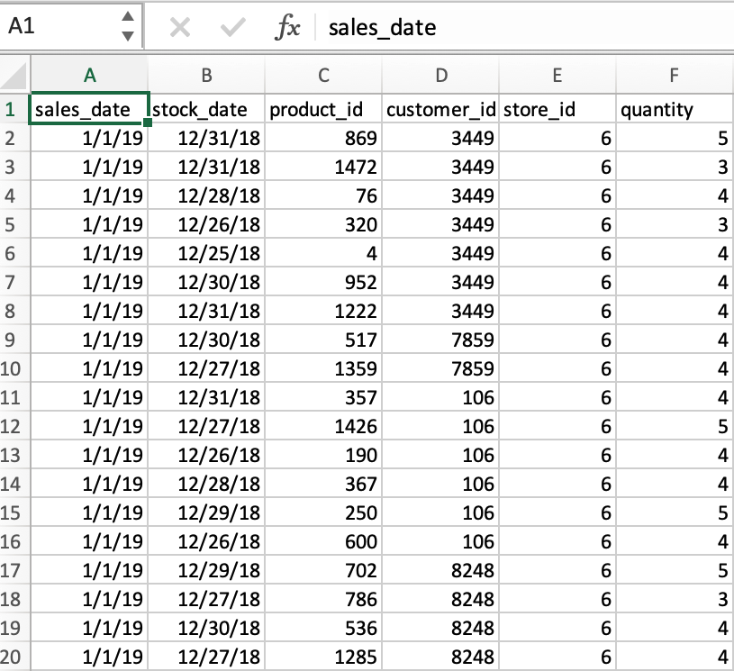
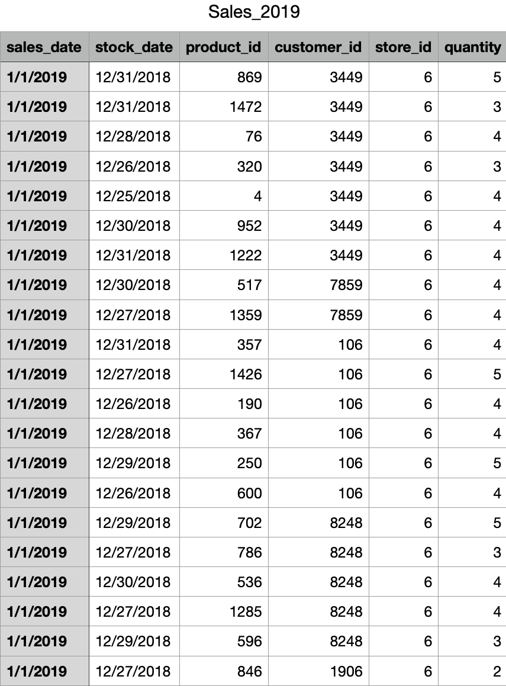
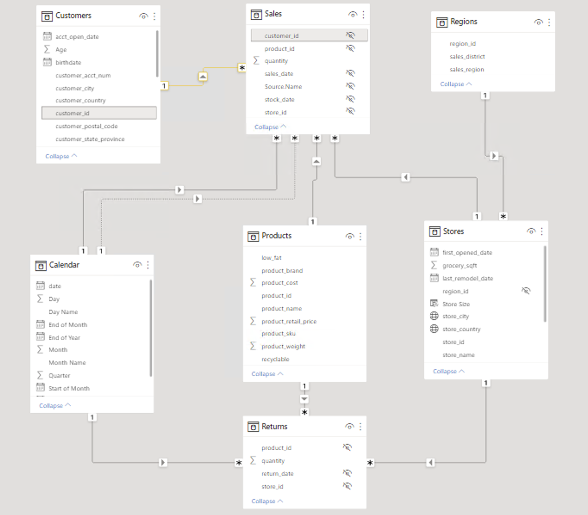
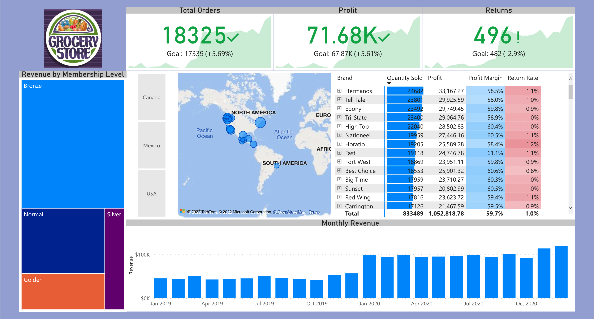

# SALES OVERVIEW 
### Project overview
* This project explores sales data for an international grocery store chain.
* I explore the relationship between variables: sales, regions, customers, products, stores, returns and calender.
* We can obtain conclusions that will help us to make better marketing campaigns and improve profits.

### Objectives:
Develop a sales report for 2019/2020 annual sales and returns.  Summarized information about the business´s current situation to understand how to make more profits. 

The most important indicators are sales, region, top customers, and top products:

**Deliverables:**

| Demanding | Value | Deliverable |
| ----------- | ----------- | ----------|
| A dashboard that summarizes the company's current situation | To understand which products and customers have the biggest impact on the company | A dashboard that shows the most important metrics and that can be updated everyday |
| An overview of sales organized by clients | To acknowledge which customers, buy more and how to sell more to them | A dashboard that can filter customers by product, city, and relevance  |
| A detailed overview of the best products | To follow those products that have better sales | A dashboard that can filter products by customer, city, and relevance |

### Data preparation

The data consists of 8 csv files, including 2 files for sales in 2019 and 2020. These will be uploaded to the Power Bi Dashboard for modeling. 

You can see all the CSV files **[HERE](https://github.com/programTristan/GroceryStore_Sales_Analysis/tree/main/csv_files)**:

### Data model:
You can see in this image the data model used in Power BI after the data was extracted.

### Visualizations 
The final product is a 3 pages dashboard. The first is a snapshot of sales performance while other two focus on customers and sale metrics

You can see the final dashboard clicking **[HERE](https://app.powerbi.com/reportEmbed?reportId=e270ad7b-c546-4d13-97f7-50fe4e91dc3a&autoAuth=true&ctid=2a144b72-f239-42d4-8c0e-6f0f17c48e33&config=eyJjbHVzdGVyVXJsIjoiaHR0cHM6Ly93YWJpLXVzLWVhc3QyLWMtcHJpbWFyeS1yZWRpcmVjdC5hbmFseXNpcy53aW5kb3dzLm5ldC8ifQ%3D%3D)** or in the image below

### Conclusions
* Mexico is the only region that met company goals
* The best customers are Ida Rodriguez, James Horvat, Dawn Laner
* The most profitale product is Landslide Seaseme Oil 
* Orders and Profits both increased from 2019 to 2020
